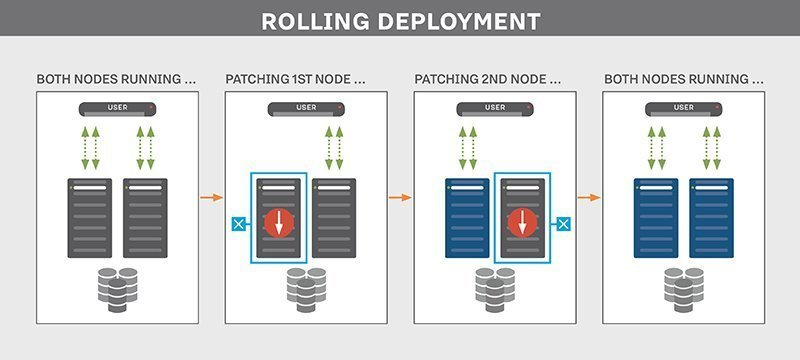

# 前端

重拾前端技术系列，包含 CSS、JS、browser API、TS（typescript）和前端工程化（工具链、测试、部署）等知识。

## 前后端如何有效沟通？

### 远程过程调用 RPC

remote procedure call 这里的“过程”可以理解为“函数”。这种接口设计和函数命名很相似，名称为**动宾结构短语**。我们常见的 HTTP API 也是一种 RPC。

### 表现层状态转移 REST

representational state transfer

REST 是低耦合、高度语义化的设计风格。它的核心要点有两个：**资源**和**方法。**

REST 的 URL 指向某个或某类资源，不再是类似 RPC 的动宾结构，而是名词。

而要进行状态转移的时候，使用的是 HTTP 默认的语义化头部 Method 字段。

- GET：获取资源
- POST： 创建资源
- PUT：更新资源
- DELETE：从服务器删除资源

REST 的缺点：弱约束、接口松散、数据冗余

### 图表查询语言 GraphQL

再次将关注点从资源转移到 API 的调用者上，从调用者的角度来思考 API 设计。对于调用者而言，最关心的不是资源和方法，而是响应内容。

核心概念其实就两个：**查询语句 query** 和 **模式 schema**，分别对应 API 的调用者和提供者。

查询语句提供了 3 种操作：查询（Query）、变更（Mutation）和订阅（Subscription）。

GraphQL 在弥补 REST 不足的同时也有所增强，表现在其高内聚、无冗余、类型校验、代码即文档。

对于前端而言，可以随心所欲地获得想要的数据类型，是相当友好的；而对于后端而言，把数据的查询结果编写成 REST API 还是 GraphQL 的解析器，工作量相差不大。**最大的问题是带来的收益可能无法抵消学习和改造成本**。

## CI/CD

- Continuous Integration，持续集成；
- Continuous Delivery，持续交付 / Continuous Deployment，持续部署
  - 持续交付：需要用户手动点击“部署”按钮才能部署到生产环境。
  - 持续部署：持续交付的更高阶段，自动化的部署到生产环境。

1. 编译（compile）和构建（build）

   编译是指将源代码变为目标代码的过程，从源代码的语言转变为另外一种计算机语言（一般为比源代码语言更为底层的语言）。

   构建是指一些列的处理，包括编译。不同的语言构建会有不通的处理步骤，最终产生可在具体特性环境运行的 artifact。
   less、sass 等转译为 css；typescript、coffeescript 等转译 javascript 。

   - 代码检查
   - 运行测试，如单元测试、E2E 测试等
   - 语言编译
   - 依赖分析、打包、替换等
   - 代码压缩、spirit 图片压缩等
   - 版本生成

2. 构建产物（artifacts）

3. 部署、发布

   部署（deploy）是指把构建后的新版本应用或服务“安装”到目标环境（开发、测试或者生产）中。
   这时候是不会有任何访问的流量。

   发布（release）是把新版本应用或者服务交付给最终用户使用的过程。
   相当于把流量切到部署好的新版本的过程。

   - 蓝绿部署 blue/green

     绿色代表代表正在给用户提供正常服务的系统；蓝色代表另外一套准备发布的系统，还未对外提供，可以做线上测试。

     **两套系统**运行在相同的基础设置和配置环境的机器上，当蓝色系统测试通过，达到上线标准，就把绿色系统的流量全部切到蓝色系统中，一旦蓝色系统出现问题，把所有流量切回到绿色系统中，待蓝色系统稳定后就成为新的绿色系统，之前的绿色系统资源就可以释放用于下一个蓝色系统。

     

     ([image source](https://www.techtarget.com/searchitoperations/answer/When-to-use-canary-vs-blue-green-vs-rolling-deployment))

   - 滚动部署 rolling

     有多个集群实例的服务中，在不影响服务的情况下，停止一个或多个实例，进行版本更新，再启动加入到集群中提供正常服务，直到所有实例都更新到最新版本。

     

     ([image source](https://www.techtarget.com/searchitoperations/answer/When-to-use-canary-vs-blue-green-vs-rolling-deployment))

   - 金丝雀部署（canary deployment）/灰度部署（gray deployment）

     与滚动部署相似，但是一种比滚动部署更有控制力度的发布策略。发布过程中，需要有一些流量控制（流量切分）的策略跟随部署的过程，一般可以在负载均衡、路由、应 用程序中做处理。

     

     ([image source](https://www.techtarget.com/searchitoperations/answer/When-to-use-canary-vs-blue-green-vs-rolling-deployment))

   - A/B 测试

     A/B 测试指的是效果测试，**同一时间有多个版本的服务在线上运行**，并通过一定的策略控制多个版本的流量分配，最终通过信息的收集，分析各个版本服务的实际效 果，选出效果最好的版本。

   A/B 测试强调的是通过不同版本对比效果来选择出最好的版本，而金丝雀部署（灰度部署）的方式正好可以满足 A/B 测试的需求。

   蓝绿部署和金丝雀部署都是发布策略，目标是确保新上线的系统稳定，关注的是新系统的 BUG、隐患。
   A/B 测试是效果测试，同一时间有多个版本的服务对外服务，这些服务有差异但是没有新旧之分。
